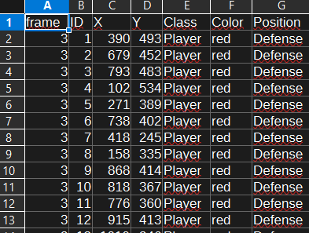

# Bachelor_rad-CV-for-tracking

# Using computer vision to track objects in real time

This repository provides a computer vision pipeline for **real-time object tracking** in video feeds. While originally developed for analyzing football matches, the core functionalities can be adapted for various tracking applications, with specialized features for tennis court analysis. The process involves four main steps:

## 1 - Object Detection

This step utilizes **YOLOv5 PyTorch Hub inference** with a pre-trained **YOLOv5l** model to identify and locate objects within video frames.

<div align="center">

</div>

For more details on YOLOv5, visit: [ultralytics/yolov5](https://github.com/ultralytics/yolov5)

## 2 - Object Tracking

Our tracking module is built upon the **Deep SORT algorithm**, providing robust and persistent object tracking across frames.

The Deep SORT implementation is adapted from: [nwojke/deep_sort](https://github.com/nwojke/deep_sort)

## 3 - Getting tracking dataframe

After step 3, the tracking data of the video footage is generated and can be used to extract various statistics and insights.

<div align="center">

</div>

## 4 - Court Coordinate Mapping and Distance Analysis

**New Feature:** The system now includes advanced court analysis capabilities specifically designed for tennis videos:

- **Edge Detection and Homography**: Automatic detection of court boundaries using edge detection algorithms and creation of homography matrices for perspective transformation
- **Coordinate Mapping**: Transformation of pixel coordinates from video footage to real tennis court coordinates
- **Distance Calculation**: Computation of distances traveled by players and ball in real-world units (meters)
- **Movement Analysis**: Detailed analysis of player movement patterns and ball trajectory

<div align="center">

</div>

All measurements and analysis results are automatically saved to CSV files for further processing and analysis.

---

# Installation

To get started with this project, follow these steps:

1.  **Clone the repository:**
    ```bash
    git clone https://github.com/aljaljak2/Bachelor_rad-CV-for-tracking
    ```
2.  **Navigate to the project directory:**
    ```bash
    cd Bachelor_rad-CV-for-tracking/
    ```
3.  **Install the dependencies:**
    ```bash
    pip install -r requirements.txt
    ```

---

# Usage

This repository offers functionalities for both detection and tracking.

### Generating Tracking Dataframe

The primary use case is to generate a dataframe containing tracking data from a video feed.

```python
from Detect_and_Track.get_init_data import get_init_data

# Call get_init_data function with arguments:
# video path, a name for the output video and the initial dataframe (with unmapped coordinates relative to TV video),
# and a list of two teams colors as described in create_df.py file, and whether or not to save only the frames with the ball detected in them.
# Note: For general object tracking, 'teams_colors' and 'ball_only' can be adapted or disregarded based on your specific objects.
get_init_data(path, out_name, teams_colors, ball_only)

# The output video with detected objects tracked, and the initial dataframe will be saved in the 'Out/' directory.
# This initial dataframe contains coordinates relative to the original video.
```

### Object Detection and Tracking Only

To generate a video with detected and tracked objects, each with a unique ID:


```python
from Detect_and_Track.get_tracks import get_video_tracks
from Detect_and_Track.create_tracking_boxes_video import create_tracking_boxes_video

# Call get_video_tracks with the path of your video footage.
# This function will save a clean video (without zoomed-in frames) in the "Out/" folder with the chosen name.
# For more information, refer to the 'Detect_and_Track/get_tracks' file.
get_video_tracks(video_path, output_video_name)

# To create a video with tracking boxes around the objects:
# This function will save a new video in the "Out/" folder with detected and tracked objects, each assigned a unique ID.
create_tracking_boxes_video(video_path, output_video_name)
```
## Tennis Court Analysis with Coordinate Mapping

For tennis videos, you can now perform advanced court analysis with multiple processing options:

### Main Processing Pipeline (Average Corners Method)

This pipeline calculates average corners from multiple frames to provide stable and robust coordinate mapping:

```python
from tennis_court_tracker import main_video_processing_pipeline

# Process tennis video with average corner detection and coordinate mapping
df_mapped, player_distances, ball_results, average_corners, frame_info = main_video_processing_pipeline(
   video_path="path/to/tennis_video.mp4",
   data_csv_path="path/to/tracking_data.csv",
   sample_interval=1.0,  # Sample every 1 second
   max_frames=30         # Use up to 30 frames for corner detection
)


# The function will automatically:
# 1. Detect tennis court corners from multiple frames
# 2. Calculate average corners for stable mapping
# 3. Create homography matrix for coordinate transformation
# 4. Map pixel coordinates to real court coordinates
# 5. Calculate distances traveled by players and ball
# 6. Save all results to multiple CSV files with detailed analysis

```

### Dynamic Processing Pipeline

This advanced pipeline dynamically calculates distances by detecting corners at specified intervals throughout the video, providing more accurate tracking for videos with camera movement:

```python
from tennis_court_tracker import main_video_processing_pipeline_dynamic

# Process tennis video with dynamic corner detection and coordinate mapping
df_mapped, player_distances, ball_results, average_corners, frame_info = main_video_processing_pipeline_dynamic(
    video_path="path/to/tennis_video.mp4",
    data_csv_path="path/to/tracking_data.csv",
    sample_interval=1.0,  # Sample every 1 second
    max_frames=30         # Use up to 30 frames for analysis
)

# This dynamic approach:
# 1. Detects court corners for each individual frame
# 2. Updates homography matrix dynamically as needed
# 3. Provides more accurate mapping for videos with camera motion
# 4. Automatically handles perspective changes throughout the video
```

### Single Frame Corner Detection
For testing and visualization purposes, you can detect and visualize corners on a single frame:

```python
import cv2
from tennis_court_tracker.corner_detection import CornerDetector

# Load a single frame for corner detection
frame_path = "./test_videos/frame_for_detection.png"
frame = cv2.imread(frame_path)

# Initialize corner detector
corner_detector = CornerDetector()

# Detect corners on the frame
corners = corner_detector.detect_court_corners(frame, debug=True)

# Draw detected corners on the frame
frame_with_corners = corner_detector.draw_corners_on_frame(frame, corners)

# Save the result
cv2.imwrite("./Out/corners_visualization.png", frame_with_corners)
```

