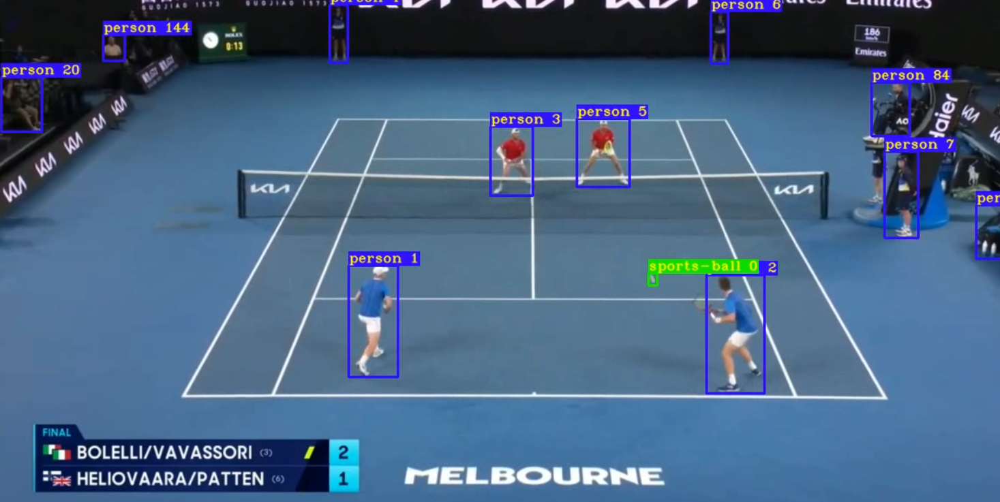

# Bachelor_rad-CV-for-tracking

# Using computer vision to track objects in real time

This repository provides a computer vision pipeline for **real-time object tracking** in video feeds. While originally developed for analyzing football matches, the core functionalities can be adapted for various tracking applications. The process involves two main steps:

### 1 - Object Detection

This step utilizes **YOLOv5 PyTorch Hub inference** with a pre-trained **YOLOv5l** model to identify and locate objects within video frames.

<div align="center">

</div>

For more details on YOLOv5, visit: [ultralytics/yolov5](https://github.com/ultralytics/yolov5)

### 2 - Object Tracking

Our tracking module is built upon the **Deep SORT algorithm**, providing robust and persistent object tracking across frames.


The Deep SORT implementation is adapted from: [nwojke/deep_sort](https://github.com/nwojke/deep_sort)

---

# Installation

To get started with this project, follow these steps:

1.  **Clone the repository:**
    ```bash
    git clone https://github.com/aljaljak2/Bachelor_rad-CV-for-tracking
    ```
2.  **Navigate to the project directory:**
    ```bash
    cd Bachelor_rad-CV-for-tracking/
    ```
3.  **Install the dependencies:**
    ```bash
    pip install -r requirements.txt
    ```

---

# Usage

This repository offers functionalities for both detection and tracking.

### Generating Tracking Dataframe

The primary use case is to generate a dataframe containing tracking data from a video feed.

```python
from Detect_and_Track.get_init_data import get_init_data

# Call get_init_data function with arguments:
# video path, a name for the output video and the initial dataframe (with unmapped coordinates relative to TV video),
# and a list of two teams colors as described in create_df.py file, and whether or not to save only the frames with the ball detected in them.
# Note: For general object tracking, 'teams_colors' and 'ball_only' can be adapted or disregarded based on your specific objects.
get_init_data(path, out_name, teams_colors, ball_only)

# The output video with detected objects tracked, and the initial dataframe will be saved in the 'Out/' directory.
# This initial dataframe contains coordinates relative to the original video.
```

### Object Detection and Tracking Only

To generate a video with detected and tracked objects, each with a unique ID:


```python
from Detect_and_Track.get_tracks import get_video_tracks
from Detect_and_Track.create_tracking_boxes_video import create_tracking_boxes_video

# Call get_video_tracks with the path of your video footage.
# This function will save a clean video (without zoomed-in frames) in the "Out/" folder with the chosen name.
# For more information, refer to the 'Detect_and_Track/get_tracks' file.
get_video_tracks(video_path, output_video_name)

# To create a video with tracking boxes around the objects:
# This function will save a new video in the "Out/" folder with detected and tracked objects, each assigned a unique ID.
create_tracking_boxes_video(video_path, output_video_name)
```